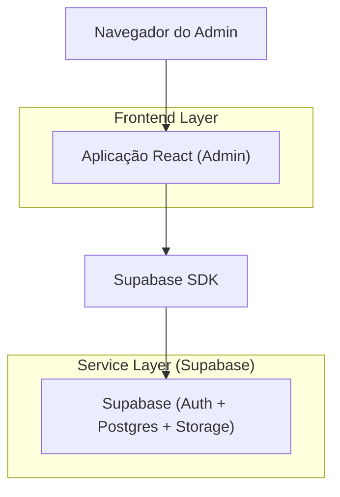
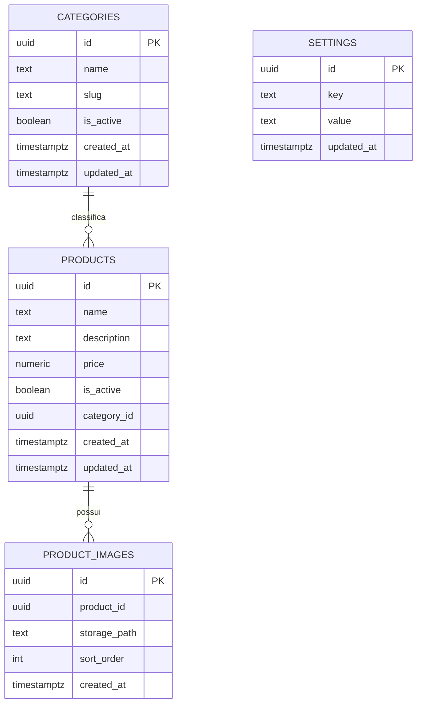

## 1.Architecture design


## 2.Technology Description
- Frontend: React@18 + vite + tailwindcss@3
- Backend: Supabase (Auth, Postgres, Storage)

## 3.Route definitions
| Route | Purpose |
|-------|---------|
| /admin/produtos | Listar e criar/editar produtos (inclui gerenciar até 3 imagens) |
| /admin/categorias | Listar e criar/editar/remover categorias |
| /admin/configuracoes | Editar configurações existentes do sistema |

## 6.Data model(if applicable)

### 6.1 Data model definition


### 6.2 Data Definition Language
Categorias (categories)
```sql
CREATE TABLE categories (
  id UUID PRIMARY KEY DEFAULT gen_random_uuid(),
  name TEXT NOT NULL,
  slug TEXT NOT NULL,
  is_active BOOLEAN NOT NULL DEFAULT TRUE,
  created_at TIMESTAMPTZ NOT NULL DEFAULT NOW(),
  updated_at TIMESTAMPTZ NOT NULL DEFAULT NOW()
);
CREATE UNIQUE INDEX idx_categories_slug ON categories (slug);
```

Produtos (products)
```sql
CREATE TABLE products (
  id UUID PRIMARY KEY DEFAULT gen_random_uuid(),
  name TEXT NOT NULL,
  description TEXT,
  price NUMERIC(12,2),
  is_active BOOLEAN NOT NULL DEFAULT TRUE,
  category_id UUID,
  created_at TIMESTAMPTZ NOT NULL DEFAULT NOW(),
  updated_at TIMESTAMPTZ NOT NULL DEFAULT NOW()
);
CREATE INDEX idx_products_category_id ON products (category_id);
CREATE INDEX idx_products_name ON products (name);
```

Imagens do produto (product_images) — limite até 3 por produto (enforced no app)
```sql
CREATE TABLE product_images (
  id UUID PRIMARY KEY DEFAULT gen_random_uuid(),
  product_id UUID NOT NULL,
  storage_path TEXT NOT NULL,
  sort_order INT NOT NULL DEFAULT 0,
  created_at TIMESTAMPTZ NOT NULL DEFAULT NOW()
);
CREATE INDEX idx_product_images_product_id ON product_images (product_id);
CREATE UNIQUE INDEX idx_product_images_product_sort ON product_images (product_id, sort_order);
```

Configurações (settings)
```sql
CREATE TABLE settings (
  id UUID PRIMARY KEY DEFAULT gen_random_uuid(),
  key TEXT NOT NULL,
  value TEXT NOT NULL,
  updated_at TIMESTAMPTZ NOT NULL DEFAULT NOW()
);
CREATE UNIQUE INDEX idx_settings_key ON settings (key);
```

Permissões (admin restrito)
```sql
GRANT ALL PRIVILEGES ON categories, products, product_images, settings TO authenticated;
```

Storage
- Bucket: product-images
- Objetos referenciados por `product_images.storage_path`
- Regras: apenas usuários autenticados podem ler/escrever no bucket do admin.
