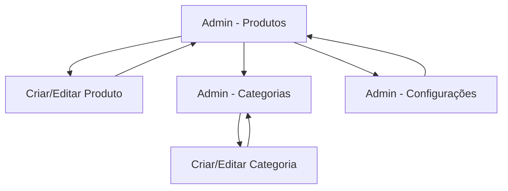

## 1. Product Overview
Redesign do Admin para gestão de Produtos, Categorias e Configurações.
O objetivo é padronizar o layout em “sidebar + cards” e melhorar a gestão de imagens (substituir/remover) com limite de até 3 imagens por produto.

## 2. Core Features

### 2.1 Feature Module
O admin redesenhado consiste nas seguintes páginas principais:
1. **Produtos**: listagem, busca/filtros básicos, criar/editar produto em layout por cards, gerenciador de imagens (até 3).
2. **Categorias**: listagem, criar/editar/remover categorias em layout por cards.
3. **Configurações**: edição de configurações existentes organizadas em cards/seções.

### 2.3 Page Details
| Page Name | Module Name | Feature description |
|-----------|-------------|---------------------|
| Produtos | Sidebar + navegação | Navegar entre módulos do admin com item ativo e estados de colapso. |
| Produtos | Lista de produtos | Listar produtos; buscar por texto; filtrar por status/categoria (quando aplicável); acionar criar/editar. |
| Produtos | Formulário em cards | Editar/criar dados do produto em seções (cards) com validação e salvar/cancelar. |
| Produtos | Gerenciador de imagens (0–3) | Exibir até 3 imagens; adicionar imagem até o limite; substituir imagem existente; remover imagem; manter ordem visual. |
| Produtos | Estados e feedback | Mostrar loading, sucesso/erro; confirmar ações destrutivas (ex.: remover imagem/produto). |
| Categorias | Lista de categorias | Listar categorias; buscar por texto; acionar criar/editar/remover. |
| Categorias | Formulário em cards | Editar/criar dados da categoria com validação e salvar/cancelar. |
| Configurações | Seções em cards | Exibir/editar configurações existentes agrupadas por tema; salvar alterações; restaurar/descartar. |
| Configurações | Estados e feedback | Mostrar loading, sucesso/erro; indicar mudanças pendentes antes de sair. |

## 3. Core Process
**Fluxo do Admin (Produtos):** acessar “Produtos” na sidebar → encontrar item via busca/filtro → abrir criar/editar → ajustar campos nos cards → gerenciar imagens (adicionar/substituir/remover, até 3) → salvar → ver feedback de sucesso/erro.

**Fluxo do Admin (Categorias):** acessar “Categorias” → listar/buscar → criar/editar dados → salvar → (opcional) remover com confirmação.

**Fluxo do Admin (Configurações):** acessar “Configurações” → editar campos agrupados por cards → salvar → ver feedback; se houver alterações pendentes, alertar antes de sair.

